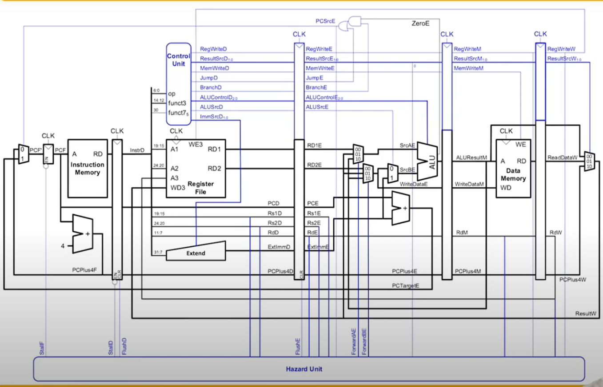

# RISC-V 32 BIT VERILOG AND FPGA IMPLEMENTATION

Building a RISC V processor in Verilog to demonstrate a diverging sequence a 7-segment display of Basys-3 board.

## Architecture

## Specifications
1. FPGA display Clock speed :- 10Hz
2. Size of Register :- 32 locations and 32 bits each
3. Size of Data Memory :- 1024 locations and 32 bits each
4. Supported list of instructons :-
    - lui
    - jal
    - beq
    - lw
    - sw
    - addi
    - ori
    - andi
    - addi
    - sub
    - or
    - and
    - slt

## Brief into of each blocks
### Program counter :- 
This is responsible for increasing the count so that the processor is able to read the next instruction after each clock cycle.
### Instruction memory :-
Stores the instruction to be decoded
### Reg file :-
Stores temporary data to be used during execution.  
### ALU :- 
Main cpu responsible for arithmetic and logical operations. 
### data memory :-
Memory to store more amount of data compared to register.   
### Control unit:-
Functions as the main control center for controlling all the above mentioned blocks 
### Hazard unit :-
Inspecting execution and load hazards by giving FLush and load commands to the respective flip flops. 
