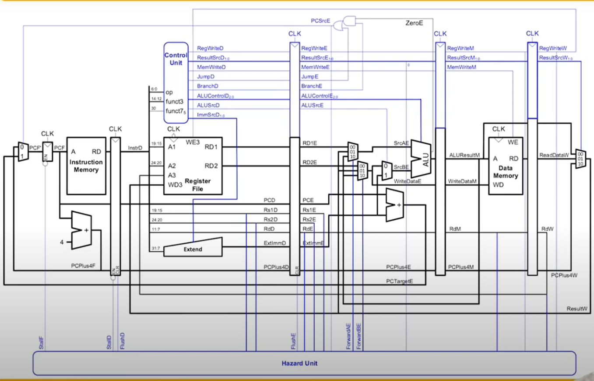
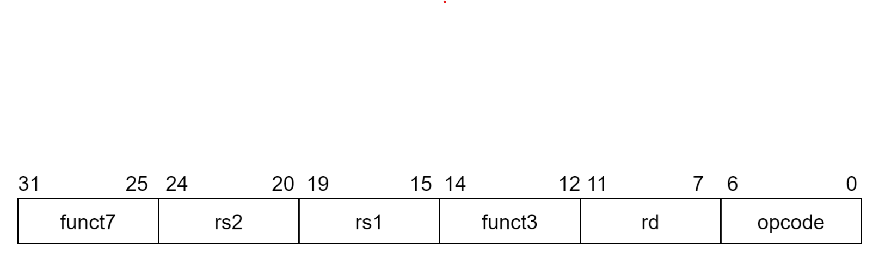
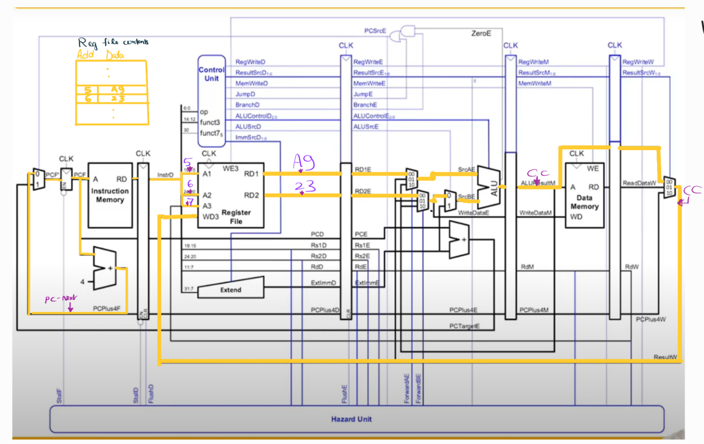
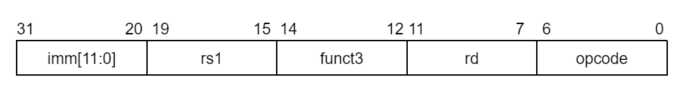
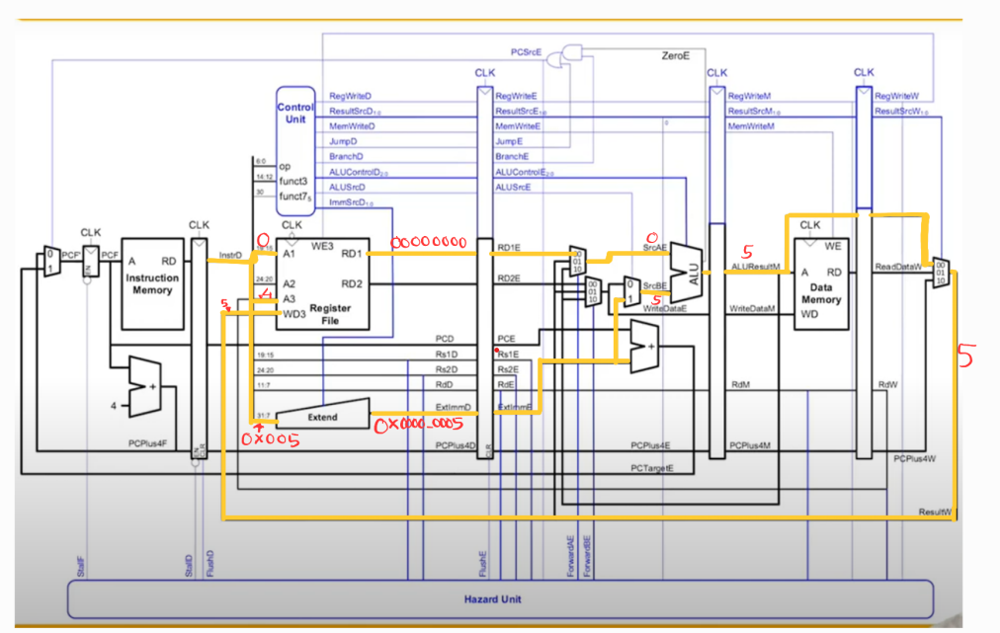
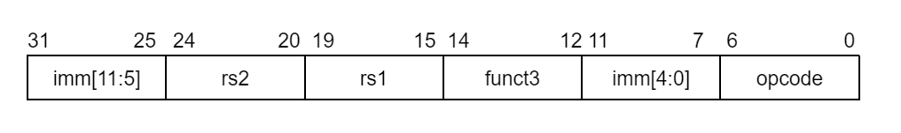
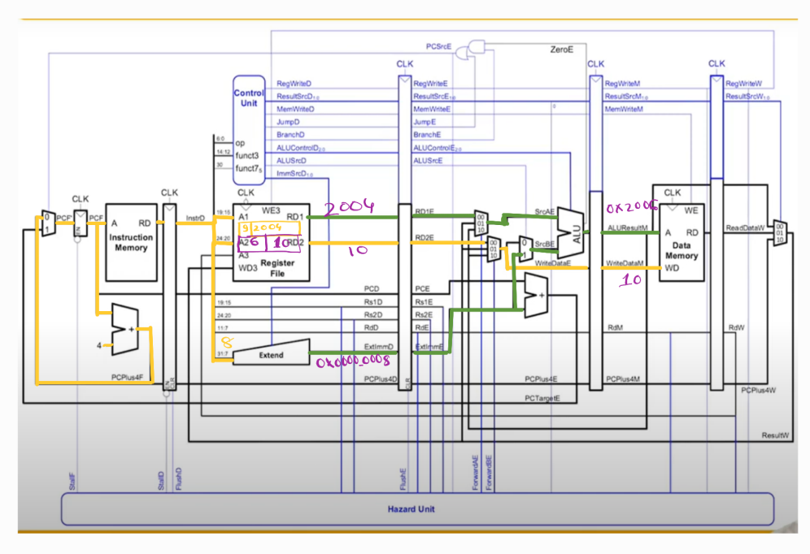
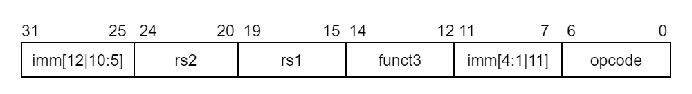

# RISC-V 32 BIT VERILOG AND FPGA IMPLEMENTATION

Building a RISC V processor in Verilog to demonstrate a diverging sequence a 7-segment display of Basys-3 board.

## Architecture

## Specifications
1. FPGA display Clock speed :- 10Hz
2. Size of Register :- 32 locations and 32 bits each
3. Size of Data Memory :- 1024 locations and 32 bits each
4. Supported list of instructons :-

| R-type | I-type | S-type | B-type | U-type | J-type |
| ------------- | ------------- | ------------- | ------------- | ------------- | ------------- | 
| add | addi  | sw  | beq  | lui | jal  |
| sub | ori  |  |  |   |    |
|slt  | andi  |   |   |   |    |
| or  |  lw |   |   |   |    |
| and  |  |   |   |   |    |
| xor  |  |   |   |   |    |
| sll  |  |   |   |   |    |
| srl  |  |   |   |   |    |

## Brief intro of each blocks
### Program counter :- 
The program counter is a fundamental component in computer architecture that keeps track of the address of the next instruction to be executed in a program.  Additionally, it aids in the execution of jump and branch instructions, wherein the program counter must redirect to a new instruction rather than the adjacent one.
### Instruction memory :-
Stores the instruction to be decoded.
### Reg file :-
Stores temporary data which is to be used during execution.  
### ALU :- 
Main cpu responsible for arithmetic and logical operations. 
### data memory :-
Memory to store more amount of data compared to register. This memory is not used during operations like register memory.   
### Control unit:-
Functions as the main control center for controlling all the above mentioned blocks 
### Hazard unit :-
Inspecting execution and load hazards by giving FLush and load commands to the respective flip flops. 
### Extend unit:- 
It is used for extending the immediate value based on the specific instruction fed into it.

## Instructions formats and brief overview

|| function |
| ------------- | ------------- |
| opcode | determines whether the instruction is I-type, R-type, I-type, B-type, U-type or J-type. |
| rd | destination register |
| rs1, rs2 | source registers 1 and 2. |
| immediate | immediate value is a constant value specified directly in the instruction. Immediate values are used in various instructions to provide constants for operations, addresses, or other parameters. |
| funct3 and funct7 | these are used to further classify the instruction within say R-type. |

## Design of Data Path
#### R-type instructions
R-Type instructions have the following format.

The R-type instruction involves the utilization of two source registers that hold the necessary data for the arithmetic or logical operation, as well as a destination register where the data is to be stored upon completion of the action.
The data stored in the registers is accessible by utilizing the addresses A1 and A2, whereas the address A3 contains the target register's address. The values to be operated on are defined by the signals RD1 and RD2, which are subsequently inserted into the Arithmetic Logic Unit (ALU). Following the specified operation, the result is returned and saved back in the register file. 

#### I-type instructions
I-type instructions have the following format.

The I-type instruction consist of destination register, source register and an immediate value. Here A1 gets the address of the source register from where the actual data is extracted and the extend block gets the immediate value. A3 gets the destination address.The ALU performs the respective operation between the extracted data and the immediate value and provides the output which is then fed back and stored at address A3 in the register file.

#### S-type instructions
S-type instructions have the following format.

The Store instruction consist of the two source registers rs1 and rs2 and a immediate value. Data stored at rs1 is added with the offset(immediate value) to get the address where the data needs to be stored. Register rs2 contains the data which is required to be stored at the address determined previously in the data memory.

#### B-type instructions
B-type instructions have the following format.

The branch type instruction(beq) consist of rs1 and rs2 as the source registers and a immediate value. The comparision is made between the values stored at rs1 and rs2 registers. ALU subtracts the values of the registers and sets zero flag to 1 if they are zero. This turns the mux of program counter to 1. The value of the address where to jump is calculated with the immediate value and the extend block output to which location to jump. Therefore the mux selects that location if it needs to jump.

#### U-type instruction
U-type instructions have the following format.
//image
The U-type instruction(LUI) consist of a destination register and only a immediate value. The immediate value determines what value is needed to be entered in the upper 20 bit of the 32 bit register. The datapath is illustrated below.

## Design of Control Path

## Execution example

## Testing in FPGA

## References
Sarah Harris playlist on RISC-V[link](https://youtu.be/lrN-uBKooRY)

MERL DSU playlist on RISC-V[link](https://www.youtube.com/watch?v=BVvDHhG0RoA&list=PL5AmAh9QoSK7Fwk9vOJu-3VqBng_HjGFc)

